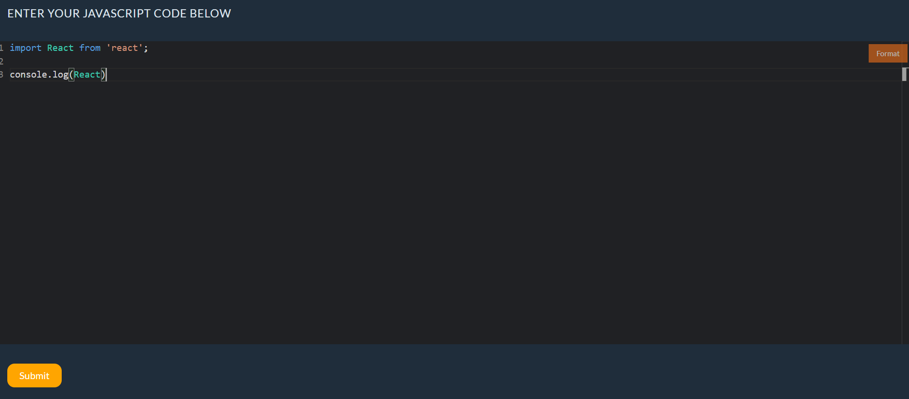

# code-book
A React application which acts as an in-browser transpiler and bundler for user entered Javascript code.

### Description
This is a single page React app. The app consist of three major components
1. Code Editor
    - An in-browser code editor which lets users enter their Javascript code
    - Supports autocomplete and syntax highlighting features.
    - Supports code formatting

2. Bundler
    - Transpiles and Bundles the user entered code to plain vanilla javascript, which can be understood by the browser.
    - Supports dynamic fetching of npm modules from the internet.
    - Built using the esbuild web assembly (esbuild-wasm) module.
    - Implemented custom plugins for the esbuild-wasm to acheive in-browser transpiling and bundling.
    - Implemented a caching layer on top of the bundler to imporve permormance by reducing the amount network request to fetch the NPM modules.

3. Preview Window
    - Receives the bundled output from the bundler and display it.

### Folder Structure
/code-book(repository) 
 - /cbook - React APP
 - README.md

### Prerequisite
1. NodeJS
2. npm

### WorkFlow
1. When you clone the GitHub repository you will have the folder structure as shown in the previous section. change in to the `cbook` directory and install the required dependencies by using the following command `npm install`.

2. Once all the dependencies have been installed you can start the application using the command `npm start`. This will open up the application in you browser.

3. On the top portion you can see the code editor. when you hover over the editor with your mouse you can also the `format` button appear on top right corner of the cod editor. Once you wrote your code if you want to autoformat it you can simply click the format button. Once done you can press the `submit` buttom below the code editor.

4. Once you press the submit button you can see the transpiled and bundled code in the preview section below.

